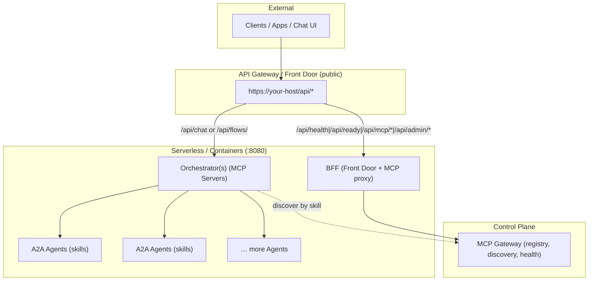

# MatrixLink Suite (MatrixHub Ecosystem)

MatrixLink Suite gives you a production-ready base to run **MCP Gateway + Orchestrators (MCP Servers) + A2A Agents** on any modern platform (IBM Code Engine, Google Cloud Run, AWS App Runner, Azure Container Apps, Knative/K8s, Local). It includes:

* `libs/matrixlink/` — PyPI-ready client for MCP discovery, A2A messaging, and Orchestrator invocation
* `apps/bff/` — Front Door (FastAPI) exposing a clean `/api/*` surface with admin & MCP proxy
* `ui/matrixhub-admin/` — Minimal React admin (read-only) for MCP servers & agents
* `infra/ce/` — IBM Code Engine scripts for apps + secrets
* `Makefile` — Dev & ops targets (`make help`)

All services bind to port **8080**. East–west calls use **Bearer service tokens** (optionally mTLS).

**Default provider = `local`**. No external services are required to run BFF + UI locally.

---

## What are MatrixHub and MatrixLink?

**MatrixHub** is an *internet-scale hub* and search engine (think **PyPI for AI agents & MCP servers**). You use it to discover high-quality agents/orchestrators by **capability** (skills, flows), **trust** (publisher, SBOM/attestation), and **fitness** (success rate, latency, region). Import chosen entries into your org’s private catalog with the right **visibility** and **policy**.

**MatrixLink** is the runtime connector: a tiny client library plus an optional BFF that makes **discovery and invocation portable** across clouds. It lets your code:
- Discover agents by **skill** via your **MCP Gateway**
- Call agents with a simple **A2A** contract (`/message/send`, optional SSE)
- Invoke orchestrators (`/invoke/<flow>`) with tenancy headers & bearer auth
- Auto-resolve service endpoints via environment variables (no code edits per provider)

**Together**: *discover globally, run locally*. You pick building blocks from MatrixHub; MatrixLink wires them into your environment safely and repeatably.

---

## Architecture



**Public API (edge):**

| Path                                        | Target       | Notes                              |
| ----------------------------------------- | ------------ | ---------------------------------- |
| `GET /api/health`                           | BFF          | liveness                           |
| `GET /api/ready`                            | BFF          | readiness (+ MCP health)           |
| `POST /api/chat` / `/api/flows/*`         | Orchestrator | main chat/flow entrypoint          |
| `/api/mcp/*`                                | BFF → MCP    | proxied, secured                   |
| `/api/admin/*`                              | BFF          | agents CRUD/run, secured           |

---

## Repository layout

```
matrixlink-suite/
├─ libs/
│  └─ matrixlink/               # PyPI client
│     ├─ pyproject.toml
│     └─ src/matrixlink/
│        ├─ __init__.py
│        ├─ config.py
│        ├─ providers.py
│        ├─ discovery.py
│        ├─ a2a.py
│        ├─ orchestrator.py
│        ├─ sse.py
│        └─ errors.py
├─ apps/
│  └─ bff/
│     ├─ Dockerfile
│     ├─ requirements.txt
│     └─ app/
│        ├─ main.py
│        ├─ auth.py
│        ├─ db.py
│        ├─ models.py
│        ├─ observability.py
│        └─ clients/
│           ├─ mcp.py
│           └─ agents.py
├─ ui/
│  └─ matrixhub-admin/
│     ├─ Dockerfile
│     ├─ package.json
│     └─ src/...
├─ infra/
│  ├─ ce/                       # IBM Code Engine scripts
│  └─ secrets/
├─ docs/                        # MkDocs site (see below)
├─ mkdocs.yml                   # MkDocs config
├─ .env.example
├─ Makefile
├─ LICENSE
└─ README.md
```

---

## Requirements
* Python 3.10+
* Node 18+ (UI)
* Docker (for container builds)
* Optional: IBM Cloud CLI for Code Engine deploys

---

## Quickstart (local)

**1) Run the BFF (Front Door)**

```bash
make install
# optional: point BFF to a local MCP Gateway (if you run one)
export MCP_BASE_URL="http://localhost:4444"
make run-bff
# → http://localhost:8080/api/health
```

**2) Run the Admin UI**

```bash
make dev-ui
# → http://localhost:3000
```
For local testing, set `export ADMIN_BEARER=changeme-admin-bearer-token` and use the same in the UI Settings.

---

## When do I need an MCP Gateway?

MatrixLink’s BFF and UI run fine **without** MCP for basic health/admin. You’ll want an **MCP Gateway** when you need:
- **Runtime discovery** of agents/orchestrators by skill/tags
- **Central registry** + **RBAC** and **visibility** per team/tenant
- **Health & fitness** signals (route only to healthy entries)
- **Controlled rollouts** (blue/green, canary via tags)

**Local dev:** you can run a lightweight MCP Gateway on `http://localhost:4444`. In cloud, point `MCP_BASE_URL` to your managed MCP instance (or resolve via `DOMAIN_SUFFIX`+`MCP_SERVICE_NAME`).

---

## Environment variables

**BFF**
* `ADMIN_BEARER` — token to guard `/api/admin/*` and `/api/mcp/*`
* `MCP_BASE_URL` — MCP Gateway URL (defaults to `http://localhost:4444` for `CLOUD_PROVIDER=local`)
* `MCP_BEARER_TOKEN` — service token to call MCP Gateway
* `AGENTS_BASE_URL` — optional static base for agents (fan-in host)
* `AGENTS_API_TOKEN` — east–west bearer for agent invocations

**MatrixLink lib**
* `CLOUD_PROVIDER` — `local` (default), `ce`, `gcrun`, `apprunner`, `aca`, `knative`
* `DOMAIN_SUFFIX` — e.g. `proj.region.codeengine.appdomain.cloud`
* `MCP_SERVICE_NAME` — default `mcp-gateway`
* `ORCH_SERVICE_NAME` — default `orchestrator`
* `AGENTS_DOMAIN_PREFIX` — default `agents`
* `MCP_BASE_URL`, `ORCH_BASE_URL`, `AGENTS_BASE_URL` — explicit overrides
* `MCP_BEARER_TOKEN`, `A2A_SERVICE_TOKEN`, `TENANT_HEADER`, `REQUEST_TIMEOUT`

---

## Using MatrixLink (Python)
Install locally from repo:
```bash
cd libs/matrixlink
pip install -e .
```
Or from PyPI (after you publish):
```bash
pip install matrixlink
```

**Discover an agent by skill (via MCP Gateway)**
```python
from matrixlink import MCPClient

mcp = MCPClient()  # reads MCP_BASE_URL or DOMAIN_SUFFIX + service name
agents = mcp.discover_agents(skill="report.generate")
print(agents[0]["endpoint"])  # https://agents.../agent-synth
```

**Send data to an A2A agent**
```python
from matrixlink import A2AClient

a2a = A2AClient()  # uses A2A_SERVICE_TOKEN if set
endpoint = "[https://agents.example.com/agent-synth](https://agents.example.com/agent-synth)"  # or from discovery
resp = a2a.send_message(endpoint, {"title": "Weekly Status", "bullets": ["A", "B", "C"]})
print(resp)
```

**Invoke an orchestrator (MCP Server) flow**
```python
from matrixlink import OrchestratorClient

orch = OrchestratorClient("[https://orchestrator.example.com](https://orchestrator.example.com)")
result = orch.invoke("hr.orchestrate", {"candidates":[{"id":"c1","skills":["py","sql"]}]})
print(result)
```

---

## Admin API (BFF)

| Method | Path | Secured? | Purpose |
|---:|:---|:---:|:---|
| `GET` | `/api/health` | ❌ | Liveness |
| `GET` | `/api/ready` | ❌ | Readiness (+ MCP health) |
| `GET` | `/api/mcp/servers` | ✅ | MCP servers list (proxy) |
| `GET` | `/api/mcp/tools` | ✅ | MCP tools list (proxy) |
| `POST` | `/api/mcp/servers` | ✅ | Create MCP server (proxy) |
| `GET` | `/api/admin/agents` | ✅ | List agents |
| `POST` | `/api/admin/agents` | ✅ | Create agent |
| `POST` | `/api/admin/agents/{id}/bind` | ✅ | Bind agent → catalog URL |
| `POST` | `/api/admin/agents/{id}/run` | ✅ | Invoke an agent by name |

Secure = requires `Authorization: Bearer ${ADMIN_BEARER}`.

---

## Docker

**BFF**
```bash
docker build -f apps/bff/Dockerfile -t local/bff:dev .
docker run --rm -p 8080:8080 \
  -e CLOUD_PROVIDER=local \
  -e ADMIN_BEARER=changeme-admin-bearer-token \
  -e MCP_BASE_URL=[http://host.docker.internal:4444](http://host.docker.internal:4444) \
  local/bff:dev
```
**Admin UI**
```bash
docker build -f ui/matrixhub-admin/Dockerfile -t local/matrixhub-admin:dev ui/matrixhub-admin
docker run --rm -p 8081:8080 local/matrixhub-admin:dev
# open http://localhost:8081
```

---

## Deploy on IBM Code Engine (example)
1.  **Create secrets** (fill tokens first):
    `./infra/secrets/create-secrets.sh`
2.  **Build & push images**:
    `make docker-build-bff docker-build-ui`
    `make docker-push-bff docker-push-ui`
3.  **Create apps**:
    `make ce-create-bff`
    `make ce-create-ui`
4.  **API Gateway routes**:
    * `/api/health|/api/ready|/api/admin/*|/api/mcp/*` -> BFF
    * `/api/chat` (or `/api/flows/<flow>`)               -> Orchestrator (separate repo/app)

---

## Other providers (env presets)

**Google Cloud Run** (custom domains recommended)
```bash
CLOUD_PROVIDER=gcrun
MCP_BASE_URL=[https://mcp-gateway.example.com](https://mcp-gateway.example.com)
ORCH_BASE_URL=[https://orchestrator.example.com](https://orchestrator.example.com)
AGENTS_BASE_URL=[https://agents.example.com](https://agents.example.com)
MCP_BEARER_TOKEN=...
A2A_SERVICE_TOKEN=...
```

**AWS App Runner**
```bash
CLOUD_PROVIDER=apprunner
MCP_BASE_URL=https://<apprunner-mcp-host>
ORCH_BASE_URL=https://<apprunner-orch-host>
AGENTS_BASE_URL=https://<apprunner-agents-host>
```

**Azure Container Apps**
```bash
CLOUD_PROVIDER=aca
DOMAIN_SUFFIX=myenv.azurecontainerapps.io
MCP_SERVICE_NAME=mcp-gateway
ORCH_SERVICE_NAME=orchestrator
AGENTS_DOMAIN_PREFIX=agents
```

**Knative / K8s**
```bash
CLOUD_PROVIDER=knative
DOMAIN_SUFFIX=apps.example.internal
MCP_SERVICE_NAME=mcp-gateway
ORCH_SERVICE_NAME=orchestrator
AGENTS_DOMAIN_PREFIX=agents
```

**Local / Docker Compose + Traefik**
```bash
CLOUD_PROVIDER=local
MCP_BASE_URL=http://localhost:4444
```

---

## Security & Ops
* **Secrets**: store tokens in provider secret stores; never in images
* **Auth**: OIDC/JWT at edge for `/api/chat`; `ADMIN_BEARER` for admin proxy; service Bearer for east–west
* **Observability**: structured logs with `X-Request-ID` / `X-Tenant-Id`; add OTEL exporters if desired
* **SSE**: ensure the API Gateway does not buffer `/stream` responses
* **Scaling**: BFF & MCP Gateway `minScale=1`; Orchestrators/Agents can scale to 0
* **DB**: BFF uses SQLite for dev; switch to a managed DB in prod via `DATABASE_URL`

---

## Make targets
```bash
make help              # list targets
make install           # venv + deps + install local matrixlink into BFF venv
make run-bff           # run BFF at :8080 (local)
make dev-ui            # run Admin UI at :3000 (Vite dev)
make build-ui          # build Admin UI static
make build-lib         # build matrixlink (wheel/sdist)
make docker-build-bff  # build BFF container
make docker-build-ui   # build UI container
make docker-push-bff   # push BFF image
make docker-push-ui    # push UI image
make ce-create-secrets # create CE secrets
make ce-create-bff     # create BFF app on CE
make ce-create-ui      # create UI app on CE
```

---

## Troubleshooting
* **`ModuleNotFoundError: matrixlink`** when running BFF locally → run `make install`.
* **MCP base URL not set** → set `MCP_BASE_URL` or use `CLOUD_PROVIDER` + `DOMAIN_SUFFIX` + `MCP_SERVICE_NAME`.
* **CORS** → set `CORS_ALLOW_ORIGINS` in BFF (e.g., `http://localhost:3000`).
* **401 on admin routes** → set `ADMIN_BEARER` and pass `Authorization: Bearer <token>` from the UI.

---

## License
Apache 2.0 — see `LICENSE`.
