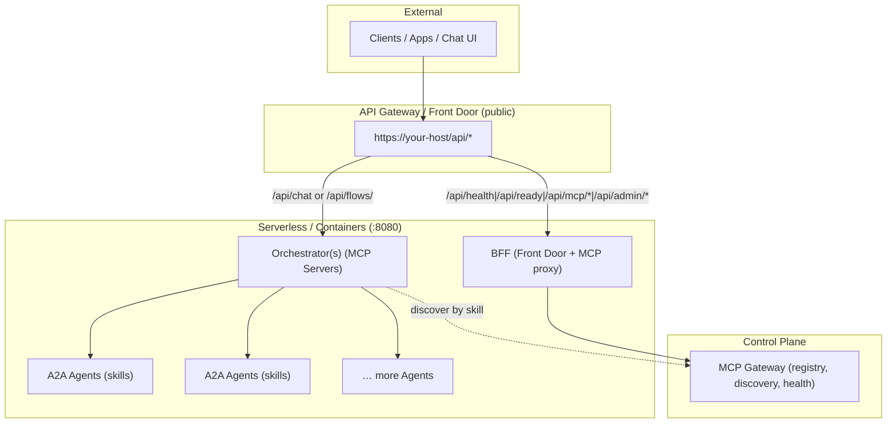

# MatrixHub × MatrixLink — internet hub + portable runtime

**MatrixHub** is an internet-scale hub and search engine (like PyPI, but for agents and MCP servers). It indexes capability cards, trust, health and fitness so your teams can **find and import** the best candidates.

**MatrixLink** is the portable, production-safe client + BFF that your apps use to **discover** and **invoke** those candidates at runtime with consistent contracts and env-based endpoints.

## What MatrixHub provides
- Open catalog & search by skill (e.g. `report.generate`), tags (`domain:finance`), modes, license, region
- Trust/quality: uptime, success rate, latency, verified publisher, SBOM/attestation
- Governance: visibility (`private|team|global`), policy filtering, team tagging
- One-click import to your org’s tenant (mirrored into your MCP Gateway)

## How MatrixLink consumes it
- `MCPClient.discover_agents(skill=..., input_mode=..., output_mode=...)`
- `MCPClient.discover_servers(role="orchestrator", tags=[...])`
- `A2AClient.send_message(endpoint, data)` and optional SSE stream
- `OrchestratorClient.invoke(flow, arguments)`
- Provider-aware resolution via `CLOUD_PROVIDER`, `DOMAIN_SUFFIX`, or explicit `*_BASE_URL`

## Typical workflow
1. Search on public MatrixHub → pick candidate(s)
2. Import into your org tenant → tagged, governed entries
3. Deploy/attach endpoints → heartbeat into MCP
4. Use MatrixLink from orchestrators/edge → discover and invoke at runtime
5. Operate rollouts (canary/blue-green) without caller code changes

## Diagram
